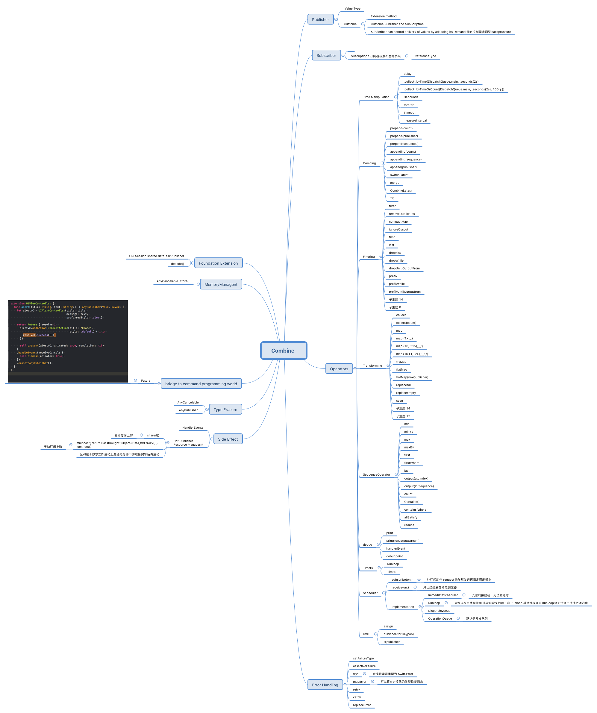

# FRPCheatSheeta
函数式编程框架：ReactiveCocoa,RXSwift速查表

# 原文地址
# 原文地址
# 原文地址

[ReactiveCocoa和RXSwift速查表](http://valiantcat.cn/2016/07/22/ReactiveCocoa%E5%92%8CRXSwift%E9%80%9F%E6%9F%A5%E8%A1%A8/)

# 感谢
在经历两个月漫长的学习时间之后，对ReactiveCocoa和RXSwift等函数响应式编程框架的学习已经有了一个非常清晰的概念。不过面对那么多的API和速记方法，脑袋实在记不住太多好用的小技巧。特在此整理了速查表。方便日后学习使用。

期中RAC-OC语言部分感谢 [iOS ReactiveCocoa 最全常用API整理（可做为手册查询）](http://www.jianshu.com/p/a4fefb434652?utm_campaign=hugo&utm_medium=reader_share&utm_content=note)作者提供的整理。加上了自己的一些补充。

下面是速记表

----
# Combine 部分

# ReactiveCocoa-Objective-C部分

----

# ReactiveCocoa-Swift部分

----

# RXSwift部分

----

# 速查表原文地址

在学习过程中当然会有疏漏，所以把有Xmind制作的脑图放在[Github](https://github.com/aiqiuqiu/FRPCheatSheeta)上，有疑问的活理解错误的地方，请回复或指正，以便后续不断更新。

